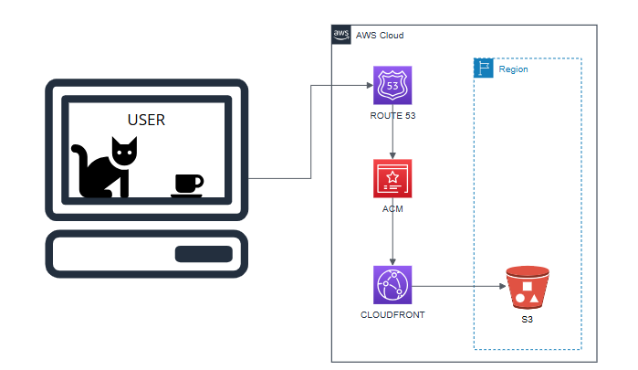

### ☕🐱 Café Gatinho - Site Institucional

Esse site é um site institucional de um café de gatos. O objetivo é usar este site como modelo para uma sandbox na AWS. Quero fazer uma arquitetura AWS simples para ele, com o objetivo de aprender como funciona a hospedagem de um site estático na AWS.

---

### 📁 Estrutura de Pastas

```
cafe-gatinho/
│
├── index.html              # Página principal do site
├── style.css               # Estilos com design minimalista
├── script.js               # Script para rolagem suave
├── img/
│   └── background-image.jpg  # Imagem de fundo (opcional)
└── README.md               # Este arquivo
```
---

### ✅ Diagrama Completo  




---

## 🧱 Componentes da Arquitetura

### 1. 🪣 Amazon S3
- **Função**: Armazenamento de arquivos estáticos do site.
- **Responsabilidade**:
  - Guarda os arquivos HTML, CSS, JS e imagens.
  - Funciona como origem para a distribuição via CDN.
- **Observação**: O bucket é configurado manualmente para hosting estático com permissões públicas de leitura.

---

### 2. 🌍 Amazon CloudFront
- **Função**: Distribuição de conteúdo com alta performance (CDN).
- **Responsabilidade**:
  - Serve os arquivos do S3 para os usuários através da rede global da AWS.
  - Garante HTTPS e caching para melhor desempenho.
  - Reduz latência ao entregar o conteúdo por **edge locations**.

---

### 3. 📛 Amazon Route 53
- **Função**: Gerenciamento de DNS e domínio personalizado.
- **Responsabilidade**:
  - Aponta o domínio `www.cafecomgatinho.com` para o CloudFront.
  - Garante que o usuário acesse o site de forma amigável e com URL personalizada.
- **Observação**: Para que o domínio utilize HTTPS, é necessário configurar um certificado SSL no **ACM**, que será usado pelo CloudFront.

---

### 4. 🔐 AWS Certificate Manager (ACM)
- **Função**: Gerenciar e provisionar certificados SSL/TLS.
- **Responsabilidade**:
  - Fornece o certificado SSL para o CloudFront.
  - Garante que a comunicação entre o navegador do usuário e o site seja segura (HTTPS).
- **Importante**: O certificado deve ser criado na região **us-east-1 (N. Virginia)** para funcionar com o CloudFront, mesmo que os demais recursos estejam em outras regiões.

---

### 5. 👩‍💻 Usuário Final
- **Ação**: Acessa o site digitando `https://www.cafecomgatinho.com` no navegador.
- **Fluxo**:
  1. O navegador consulta o DNS via Route 53.
  2. Route 53 aponta para a distribuição do CloudFront.
  3. CloudFront utiliza o certificado SSL do ACM para comunicação segura.
  4. CloudFront entrega o conteúdo estático hospedado no S3.
  5. O site é exibido de forma rápida, segura e com HTTPS válido.

---

## ✅ Benefícios da Arquitetura

- 🌐 **Alta disponibilidade** com entrega global via CloudFront  
- 🔒 **HTTPS incluso** com SSL gratuito via ACM  
- 📦 **Baixo custo** com S3 e escalabilidade automática  
- 🌱 **Fácil de manter e escalar** conforme o site cresce  
- 🛠️ **Controle total do deploy** com upload manual ou via CLI/scripts


